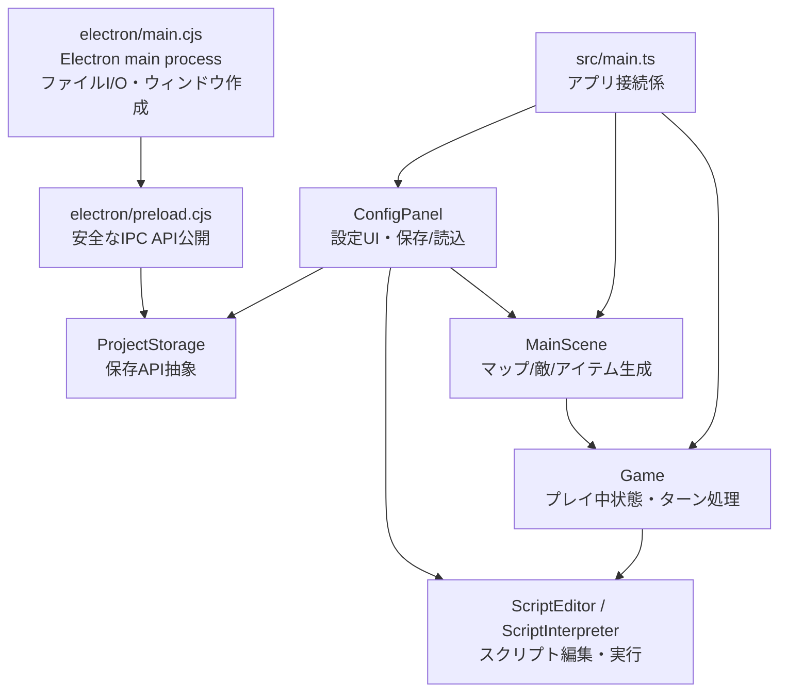
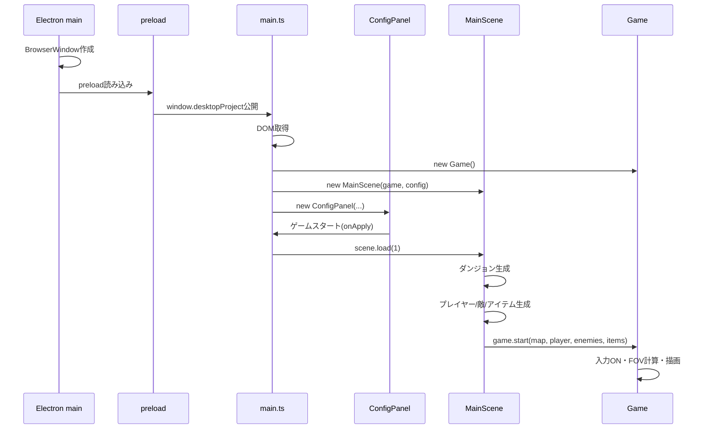
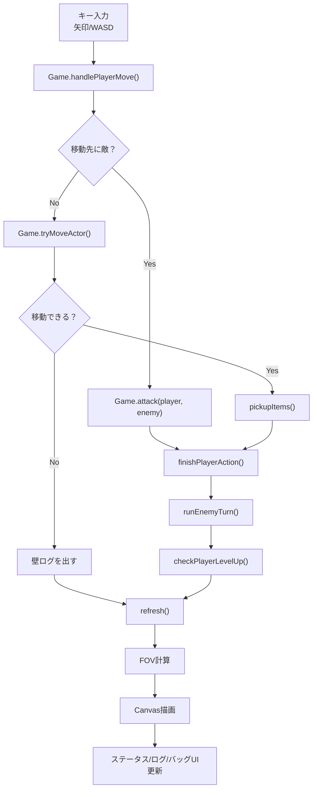
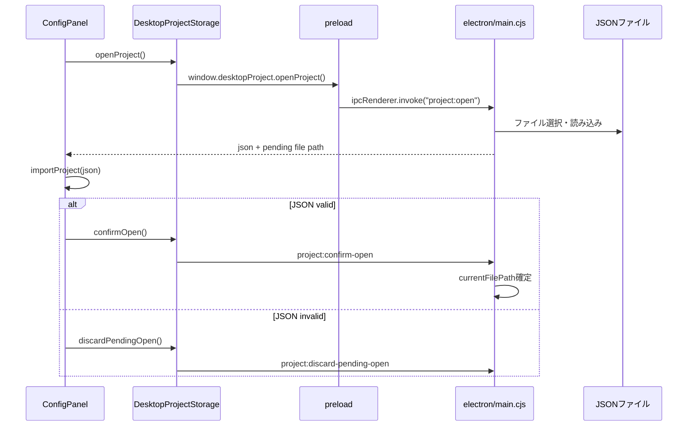
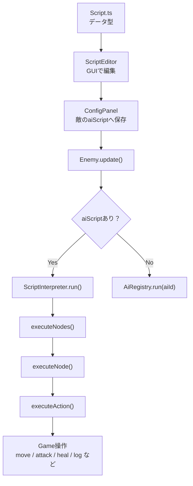

# コード読み解きマップ

このメモは、ローグライクツクールのコードを読むための全体地図です。

## 全体構造

## 起動からゲーム開始

## ゲーム中の1ターン

## 保存/読込

## スクリプトエンジン

## 読む順番

1. `src/main.ts`
2. `src/game/MainScene.ts`
3. `src/engine/core/Game.ts`
4. `src/app/ui/ConfigPanel.ts`
5. `src/app/storage/ProjectStorage.ts`
6. `electron/preload.cjs`
7. `electron/main.cjs`
8. `src/engine/script/Script.ts`
9. `src/app/ui/ScriptEditor.ts`
10. `src/engine/script/ScriptInterpreter.ts`

最初の理解目標は、`ConfigPanel` が設定を作り、`MainScene` がゲームを組み立て、`Game` がプレイを進める、と説明できることです。
